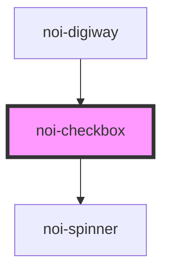

<!--
SPDX-FileCopyrightText: NOI Techpark <digital@noi.bz.it>

SPDX-License-Identifier: CC0-1.0
-->
# noi-checkbox

<!-- Auto Generated Below -->

## Overview

(INTERNAL) render a checkbox

## Properties

| Property   | Attribute  | Description         | Type      | Default |
| ---------- | ---------- | ------------------- | --------- | ------- |
| `checked`  | `checked`  |                     | `boolean` | `false` |
| `disabled` | `disabled` | 'disabled' property | `boolean` | `false` |
| `loading`  | `loading`  |                     | `boolean` | `false` |

## Events

| Event           | Description                            | Type                                 |
| --------------- | -------------------------------------- | ------------------------------------ |
| `checkedChange` | Emitted when user clicks on the button | `CustomEvent<{ checked: boolean; }>` |

## Dependencies

### Used by

 - [noi-digiway](../../public-components/digiway)

### Depends on

- [noi-spinner](../spinner)

### Graph

----------------------------------------------

*Built with [StencilJS](https://stenciljs.com/)*
