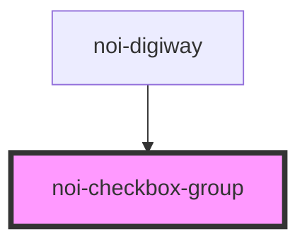

<!--
SPDX-FileCopyrightText: NOI Techpark <digital@noi.bz.it>

SPDX-License-Identifier: CC0-1.0
-->
# noi-checkbox

<!-- Auto Generated Below -->

## Overview

(INTERNAL) render a checkbox group

## Properties

| Property | Attribute | Description | Type      | Default |
| -------- | --------- | ----------- | --------- | ------- |
| `open`   | `open`    |             | `boolean` | `false` |

## Dependencies

### Used by

 - [noi-digiway](../../public-components/digiway)

### Graph

```mermaid
graph TD;
  noi-digiway --> noi-checkbox-group
  style noi-checkbox-group fill:#f9f,stroke:#333,stroke-width:4px
```

----------------------------------------------

*Built with [StencilJS](https://stenciljs.com/)*
