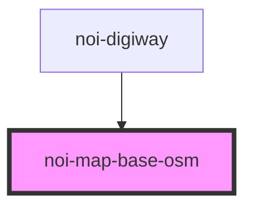

<!--
SPDX-FileCopyrightText: NOI Techpark <digital@noi.bz.it>

SPDX-License-Identifier: CC0-1.0
-->
# noi-map-base-osm

<!-- Auto Generated Below -->

## Overview

(INTERNAL) render map layer

## Properties

| Property  | Attribute | Description | Type                     | Default   |
| --------- | --------- | ----------- | ------------------------ | --------- |
| `variant` | `variant` |             | `"color" \| "grayscale"` | `'color'` |

## Dependencies

### Used by

 - [noi-digiway](../../public-components/digiway)

### Graph

----------------------------------------------

*Built with [StencilJS](https://stenciljs.com/)*
