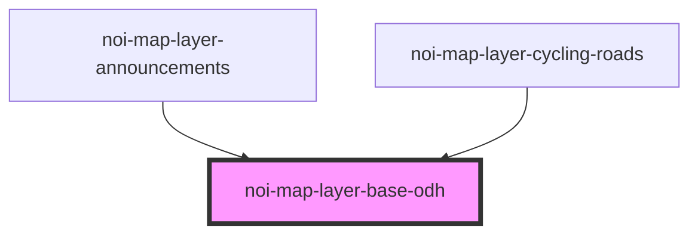

<!--
SPDX-FileCopyrightText: NOI Techpark <digital@noi.bz.it>

SPDX-License-Identifier: CC0-1.0
-->
# noi-map-layer-announcements

<!-- Auto Generated Below -->

## Overview

(INTERNAL) render map layer

## Properties

| Property              | Attribute | Description | Type                                                                             | Default     |
| --------------------- | --------- | ----------- | -------------------------------------------------------------------------------- | ----------- |
| `config` _(required)_ | --        |             | `LayerConfig`                                                                    | `undefined` |
| `popupStructure`      | --        |             | `(feature: MapGeoJSONFeature, featureType: string) => string \| PopupDefinition` | `undefined` |

## Events

| Event          | Description                        | Type                   |
| -------------- | ---------------------------------- | ---------------------- |
| `layerLoading` | Emitted when layer data is loading | `CustomEvent<boolean>` |

## Dependencies

### Used by

 - [noi-map-layer-announcements](../map-layer-announcements)
 - [noi-map-layer-cycling-roads](../map-layer-cycling-roads)

### Graph

----------------------------------------------

*Built with [StencilJS](https://stenciljs.com/)*
