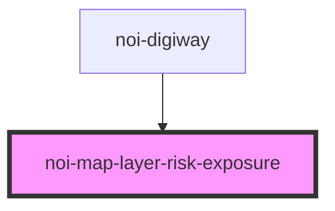

<!--
SPDX-FileCopyrightText: NOI Techpark <digital@noi.bz.it>

SPDX-License-Identifier: CC0-1.0
-->
# noi-map-layer-risk-exposure

<!-- Auto Generated Below -->

## Overview

(INTERNAL) render map layer

## Events

| Event          | Description                        | Type                   |
| -------------- | ---------------------------------- | ---------------------- |
| `layerLoading` | Emitted when layer data is loading | `CustomEvent<boolean>` |

## Dependencies

### Used by

 - [noi-digiway](../../public-components/digiway)

### Graph

----------------------------------------------

*Built with [StencilJS](https://stenciljs.com/)*
