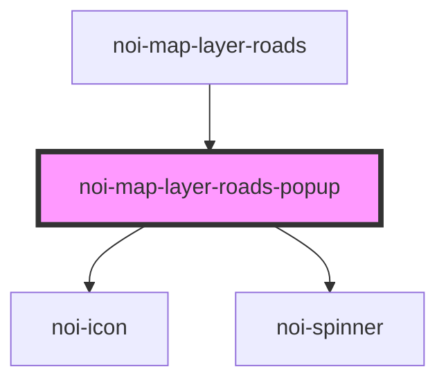

<!--
SPDX-FileCopyrightText: NOI Techpark <digital@noi.bz.it>

SPDX-License-Identifier: CC0-1.0
-->
# noi-map-layer-roads-popup

<!-- Auto Generated Below -->

## Overview

(INTERNAL) render map popup

## Methods

### `setName(geoName: string) => Promise<void>`

#### Parameters

| Name      | Type     | Description |
| --------- | -------- | ----------- |
| `geoName` | `string` |             |

#### Returns

Type: `Promise<void>`

### `setPointId(roadId: string) => Promise<void>`

#### Parameters

| Name     | Type     | Description |
| -------- | -------- | ----------- |
| `roadId` | `string` |             |

#### Returns

Type: `Promise<void>`

### `setPopupHeader(headerConfig: HeaderConfig) => Promise<void>`

#### Parameters

| Name           | Type           | Description |
| -------------- | -------------- | ----------- |
| `headerConfig` | `HeaderConfig` |             |

#### Returns

Type: `Promise<void>`

## Shadow Parts

| Part      | Description |
| --------- | ----------- |
| `"popup"` |             |

## Dependencies

### Used by

 - [noi-map-layer-roads](../map-layer-roads)

### Depends on

- [noi-icon](../icon)
- [noi-spinner](../spinner)

### Graph

----------------------------------------------

*Built with [StencilJS](https://stenciljs.com/)*
