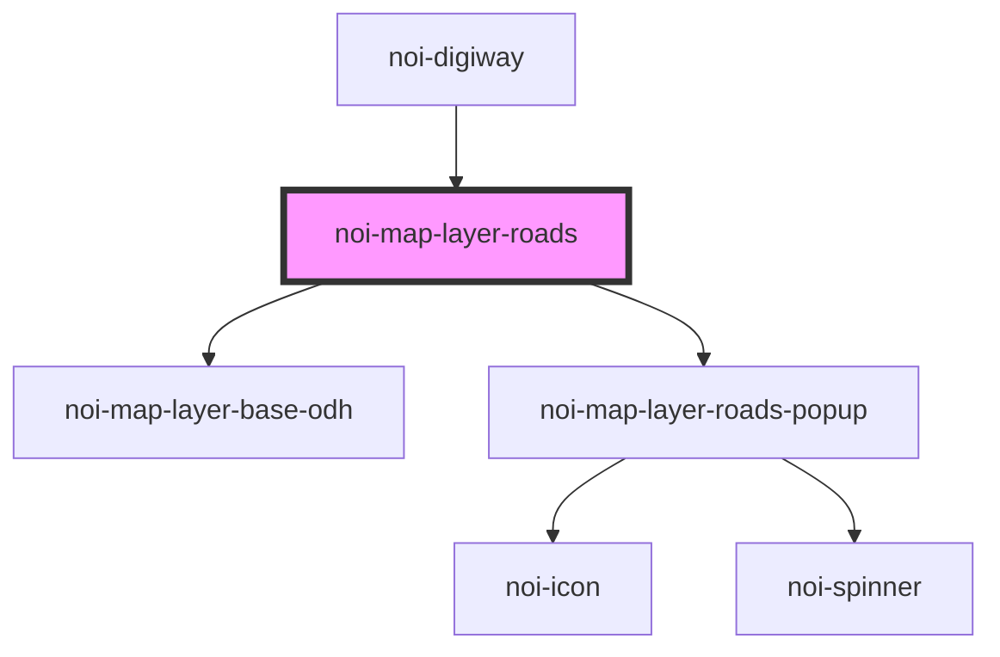

<!--
SPDX-FileCopyrightText: NOI Techpark <digital@noi.bz.it>

SPDX-License-Identifier: CC0-1.0
-->
# noi-map-layer-announcements

<!-- Auto Generated Below -->

## Overview

(INTERNAL) render map layer

## Properties

| Property              | Attribute    | Description | Type                                                                                                                                        | Default     |
| --------------------- | ------------ | ----------- | ------------------------------------------------------------------------------------------------------------------------------------------- | ----------- |
| `region` _(required)_ | `region`     |             | `"bolzano-int" \| "bolzano-prov" \| "hiking-bolzano" \| "hiking-trento" \| "mountainbikeroutes" \| "mtb_percorsi_v" \| "trento" \| "tyrol"` | `undefined` |
| `titleIcon`           | `title-icon` |             | `string`                                                                                                                                    | `undefined` |
| `titleText`           | `title-text` |             | `string`                                                                                                                                    | `undefined` |

## Events

| Event          | Description                        | Type                   |
| -------------- | ---------------------------------- | ---------------------- |
| `layerLoading` | Emitted when layer data is loading | `CustomEvent<boolean>` |

## Dependencies

### Used by

 - [noi-digiway](../../public-components/digiway)

### Depends on

- [noi-map-layer-base-odh](../map-layer-base-odh)
- [noi-map-layer-roads-popup](../map-layer-roads-popup)

### Graph

----------------------------------------------

*Built with [StencilJS](https://stenciljs.com/)*
