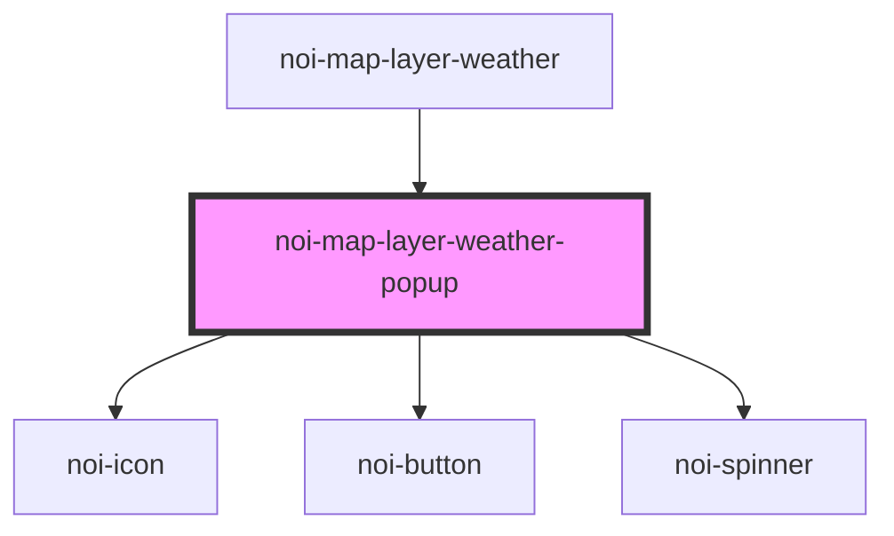

<!--
SPDX-FileCopyrightText: NOI Techpark <digital@noi.bz.it>

SPDX-License-Identifier: CC0-1.0
-->
# noi-map-layer-weather-popup

<!-- Auto Generated Below -->

## Overview

(INTERNAL) render map popup

## Methods

### `setFeature(feature: MapGeoJSONFeature) => Promise<void>`

#### Parameters

| Name      | Type                                                                                                                                                                                                                                                                                                                                                                                                                                                                                                                                                                                              | Description |
| --------- | ------------------------------------------------------------------------------------------------------------------------------------------------------------------------------------------------------------------------------------------------------------------------------------------------------------------------------------------------------------------------------------------------------------------------------------------------------------------------------------------------------------------------------------------------------------------------------------------------- | ----------- |
| `feature` | `GeoJSONFeature & { layer: (Omit<FillLayerSpecification, "source"> \| Omit<LineLayerSpecification, "source"> \| Omit<SymbolLayerSpecification, "source"> \| Omit<CircleLayerSpecification, "source"> \| Omit<HeatmapLayerSpecification, "source"> \| Omit<FillExtrusionLayerSpecification, "source"> \| Omit<RasterLayerSpecification, "source"> \| Omit<HillshadeLayerSpecification, "source"> \| Omit<ColorReliefLayerSpecification, "source"> \| Omit<BackgroundLayerSpecification, "source">) & { source: string; }; source: string; sourceLayer?: string; state: { [key: string]: any; }; }` |             |

#### Returns

Type: `Promise<void>`

## Shadow Parts

| Part      | Description |
| --------- | ----------- |
| `"popup"` |             |

## Dependencies

### Used by

 - [noi-map-layer-weather](../map-layer-weather)

### Depends on

- [noi-icon](../icon)
- [noi-button](../button)
- [noi-spinner](../spinner)

### Graph

----------------------------------------------

*Built with [StencilJS](https://stenciljs.com/)*
