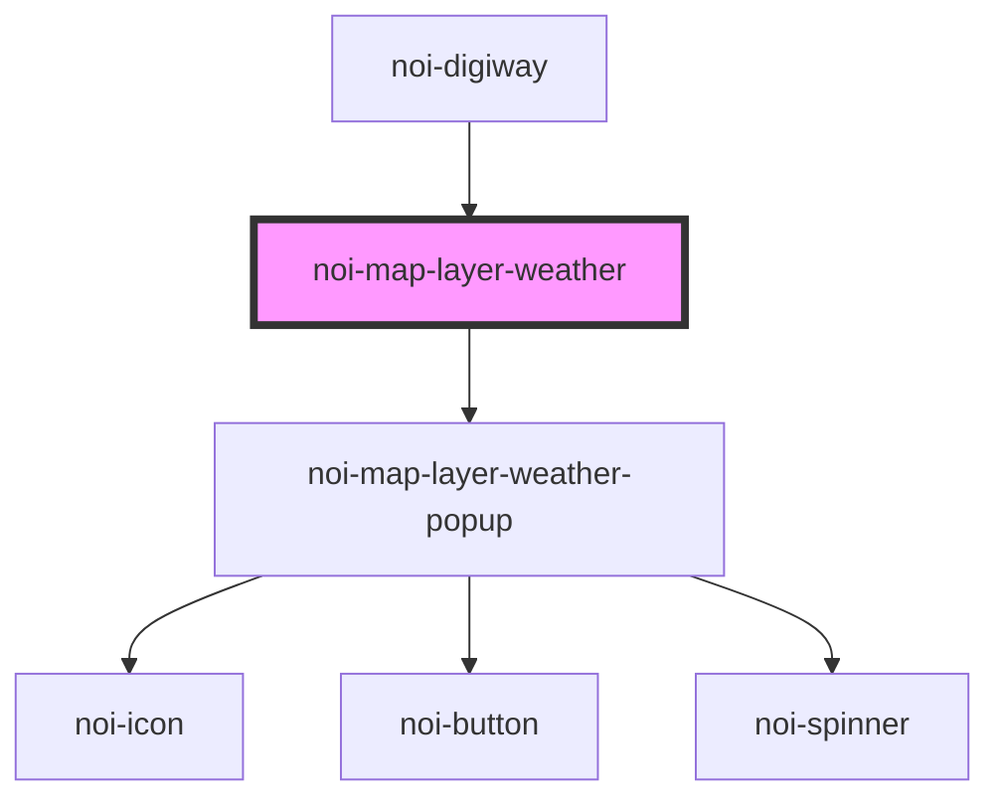

<!--
SPDX-FileCopyrightText: NOI Techpark <digital@noi.bz.it>

SPDX-License-Identifier: CC0-1.0
-->
# noi-map-layer-weather

<!-- Auto Generated Below -->

## Overview

(INTERNAL) render map layer

## Properties

| Property   | Attribute | Description                | Type   | Default     |
| ---------- | --------- | -------------------------- | ------ | ----------- |
| `viewDate` | --        | View date for weather data | `Date` | `undefined` |

## Events

| Event          | Description                        | Type                   |
| -------------- | ---------------------------------- | ---------------------- |
| `layerLoading` | Emitted when layer data is loading | `CustomEvent<boolean>` |

## Dependencies

### Used by

 - [noi-digiway](../../public-components/digiway)

### Depends on

- [noi-map-layer-weather-popup](../map-layer-weather-popup)

### Graph

----------------------------------------------

*Built with [StencilJS](https://stenciljs.com/)*
