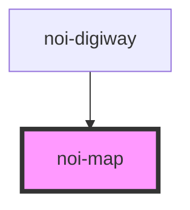

<!--
SPDX-FileCopyrightText: NOI Techpark <digital@noi.bz.it>

SPDX-License-Identifier: CC0-1.0
-->

# noi-brennerlec-map

<!-- Auto Generated Below -->

## Overview

(INTERNAL) render a basic map with no layouts

## Properties

| Property    | Attribute   | Description                                                                                                           | Type     | Default     |
| ----------- | ----------- | --------------------------------------------------------------------------------------------------------------------- | -------- | ----------- |
| `centermap` | `centermap` | Map center. Pass latitude, longitude and zoomlevel separated by "," if map should be centered an a specific gps point | `string` | `undefined` |

## Events

| Event      | Description                                             | Type                 |
| ---------- | ------------------------------------------------------- | -------------------- |
| `mapReady` | Emitted when map is initialized and ready to draw on it | `CustomEvent<Map$1>` |

## Methods

### `getMapAsync() => Promise<Map>`

#### Returns

Type: `Promise<Map$1>`

## Dependencies

### Used by

 - [noi-digiway](../../public-components/digiway)

### Graph

----------------------------------------------

*Built with [StencilJS](https://stenciljs.com/)*
