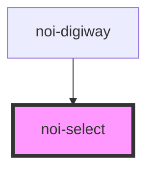

<!--
SPDX-FileCopyrightText: NOI Techpark <digital@noi.bz.it>

SPDX-License-Identifier: CC0-1.0
-->
# noi-select

<!-- Auto Generated Below -->

## Overview

(INTERNAL) render a select box

## Properties

| Property   | Attribute  | Description                | Type             | Default     |
| ---------- | ---------- | -------------------------- | ---------------- | ----------- |
| `disabled` | `disabled` | button 'disabled' property | `boolean`        | `false`     |
| `options`  | --         |                            | `SelectOption[]` | `undefined` |
| `value`    | `value`    |                            | `string`         | `null`      |

## Events

| Event          | Description                            | Type                  |
| -------------- | -------------------------------------- | --------------------- |
| `selectChange` | Emitted when user clicks on the button | `CustomEvent<string>` |

## Dependencies

### Used by

 - [noi-digiway](../../public-components/digiway)

### Graph

----------------------------------------------

*Built with [StencilJS](https://stenciljs.com/)*
