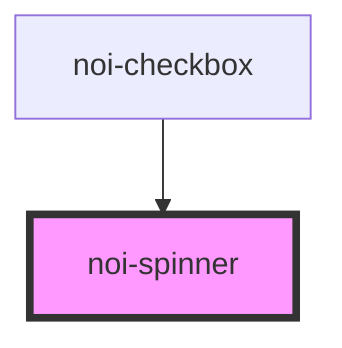

<!--
SPDX-FileCopyrightText: NOI Techpark <digital@noi.bz.it>

SPDX-License-Identifier: CC0-1.0
-->
# noi-spinner

<!-- Auto Generated Below -->

## Overview

(INTERNAL) render a apinner.

Icons are embedded inside the component (so far).

Icon size can be changed by 'font-size' style

## Dependencies

### Used by

 - [noi-checkbox](../checkbox)

### Graph

----------------------------------------------

*Built with [StencilJS](https://stenciljs.com/)*
