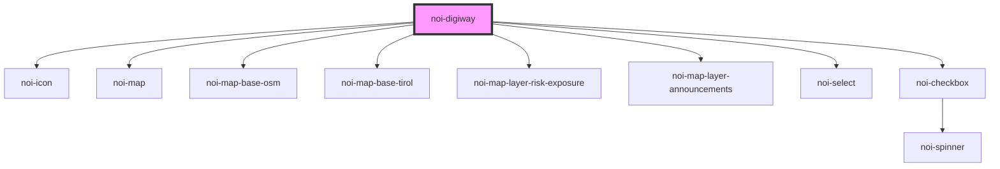

<!--
SPDX-FileCopyrightText: NOI Techpark <digital@noi.bz.it>

SPDX-License-Identifier: CC0-1.0
-->
# noi-digiway

<!-- Auto Generated Below -->

## Overview

Consolidated web-component to show Open Data Hub data imported within the Digiway project

## Properties

| Property    | Attribute   | Description                                                                                               | Type                                          | Default     |
| ----------- | ----------- | --------------------------------------------------------------------------------------------------------- | --------------------------------------------- | ----------- |
| `baseMap`   | `base-map`  | Base map layer                                                                                            | `"osm" \| "tirol"`                            | `'tirol'`   |
| `centermap` | `centermap` | Pass latitude, longitude and zoomlevel separated by "," if map should be centered an a specific gps point | `string`                                      | `undefined` |
| `language`  | `language`  | Language                                                                                                  | `string`                                      | `'en'`      |
| `layout`    | `layout`    | Layout appearance                                                                                         | `"auto" \| "desktop" \| "mobile" \| "tablet"` | `'auto'`    |

## Shadow Parts

| Part                 | Description      |
| -------------------- | ---------------- |
| `"legend"`           | Legend           |
| `"legend-container"` | Legend container |
| `"map"`              | Map              |
| `"popup"`            | Map popup dialog |
| `"sidebar"`          | Sidebar          |

## CSS Custom Properties

| Name                       | Description                                  |
| -------------------------- | -------------------------------------------- |
| `--color-background`       | Background color                             |
| `--color-background-hover` | Background color on hover                    |
| `--color-border`           | Border color                                 |
| `--color-primary`          | Primary color                                |
| `--color-secondary`        | Secondary color                              |
| `--color-text`             | Text color                                   |
| `--map-filter`             | 'filter' property for the map                |
| `--sidebar-width`          | Sidebar with (for desktop and tablet layout) |

## Dependencies

### Depends on

- [noi-icon](../../blocks/icon)
- [noi-map](../../blocks/map)
- [noi-map-base-osm](../../blocks/map-base-osm)
- [noi-map-base-tirol](../../blocks/map-base-tyrol)
- [noi-map-layer-risk-exposure](../../blocks/map-layer-risk-exposure)
- [noi-map-layer-announcements](../../blocks/map-layer-announcements)
- [noi-select](../../blocks/select)
- [noi-checkbox](../../blocks/checkbox)

### Graph

----------------------------------------------

*Built with [StencilJS](https://stenciljs.com/)*
